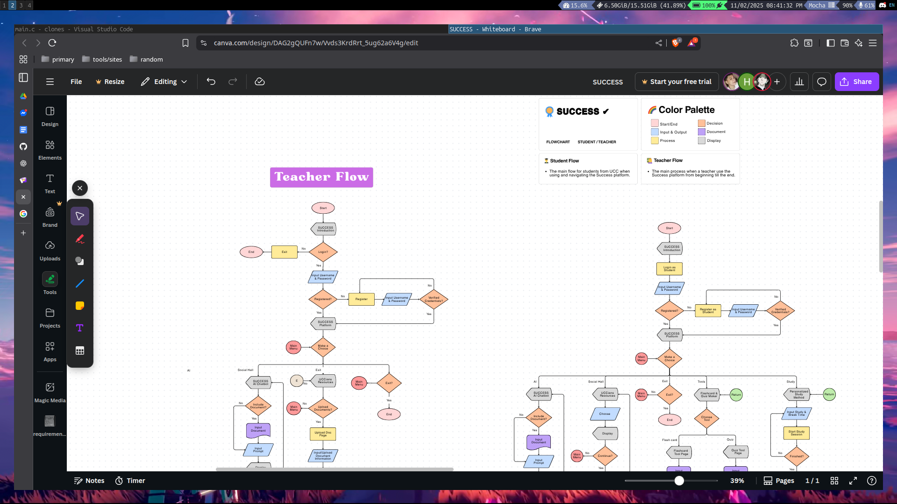

<h1>SUCCESS  
powered by A.I   
</h1>

<h3> DESCRIPTION </h3>
This system is a collaborative platform for yusisiyans to connect, learn, and grow together. It includes tools such as quizzes, flashcards, summarizers to make studying more engaging and productive. The system applies proven study methods which are the Pomodoro, active recall, and spaced repetition which can be tailored to each student’s learning style for more effective study sessions.  
  
Students and teachers can collaborate, share resources, and discuss lessons within the platform. It also lets students track progress, mark completed tasks, and prepare for upcoming lessons. With offline accessibility, learning materials remain available even without internet access.
 
 

  
 <h3>Read more</h3> 

  <h3 align="left">FEATURES</h3> 

	The main key features of the system are the following below:

<b>Social Hall:</b> A central space where students and teachers can connect, share resources, upload notes, ask questions, and exchange answers to support collective learning.  
<b>Personalized Study Methods:</b> Integrates proven techniques (Pomodoro, active recall, spaced repetition, etc.) tailored to each student’s learning style.  
<b>Academic Progress Tracking (Todo List):</b> Allows students to monitor their performance, mark completed subjects, and prepare for upcoming lessons.  
<b>AI-powered Academic Tools:</b> Smart utilities such as quiz and flashcard generators, summarizers, personalized study suggestions, and integrated AI chatbot that help students grasp concepts faster and study more effectively.  
<b>Offline Accessibility:</b> Stores data locally to ensure resources remain available without internet access.   

<h3 align="left">LIMITATIONS</h3>

	The main limitation that some users might encounter in its development stages

  
Restricted to UCCians users: This platform only primarily focuses on users within the UCC North Campus vicinity and doesn't support outsiders.    
This system only used C programming langauge as its backbone for almost every function, hindering the ability of many users to access it  (we have no choice either way but to comply with our prof)

<!--
 commented out will bring back soon
<h3 align="left">HOW DOES THIS SYSTEM WORK?</h3>

	I have no idea what to put here actually

  
i'll leave this part blank for a while

<h3 align="left">HOW TO DOWNLOAD AND RUN THIS SYSTEM ON LAPTOP/PC?</h3>

	FOR LINUX USERS:

  
Make sure you have git on your device by typing on terminal git --version  
If you have one create a file directory anywhere you want just make sure to copy the file path  
Go on you terminal and type cd (file path of the directory you've made earlier)  
Copy the url of the repo of this system https://github.com/aikhe/success.git   
Clone the global repo into the directory you've made earlier by typing git clone (repo url)  
idk the rest-->

<h3 align="left">TOOLS/LANGUAGES USED</h3>

<h3 align="left">GALLERY</h3>

 

